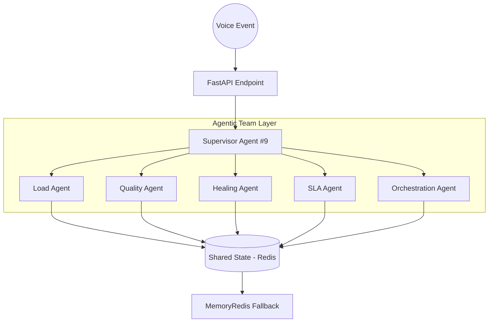

# Agentic Voice Telecom OS

A hardened, multi-agent collaboration framework for autonomous voice operations. Featuring self-healing, SLA-aware routing, and voice quality intelligence.

## 🏗️ Architecture



## 🚀 Features

-   **Supervisor #9 Routing**: Centralized logic for deterministic agent handoffs.
-   **Self-Healing**: Automatic retry logic with exponential backoff and provider switching.
-   **Voice Quality Intelligence**: Real-time RTP/Jitter analysis with codec adaptation.
-   **SLA Awareness**: Sliding window metrics for breach detection and recovery tracking.
-   **Load Management**: Token-bucket concurrency control with SMS fallbacks.
-   **Hardened Edges**: Global abort triggers for simultaneous failure protection.

## 🛠️ Setup

### WSL / Linux
1.  Install dependencies: `pip install -r requirements.txt`
2.  Start Redis (Optional, system falls back to MemoryRedis if unavailable).
3.  Run the OS: `uvicorn app.main:app --host 0.0.0.0 --port 8000`

### Docker
```bash
docker build -t voice-os .
docker run -p 8000:8000 voice-os
```

## 📡 API Usage

### Send Voice Event
`POST /call/event`
```json
{
  "call_id": "c123",
  "event_type": "CALL_FAILED",
  "error_reason": "NO_ANSWER",
  "rtp_loss": 6.0
}
```

## 📋 Troubleshooting
-   **Redis Down?** The system automatically switches to `MemoryRedis`. Logs will show `⚠️ Using In-Memory Redis Fallback`.
-   **High Latency?** Check Redis TTLs and network jitter signals in the logs.
